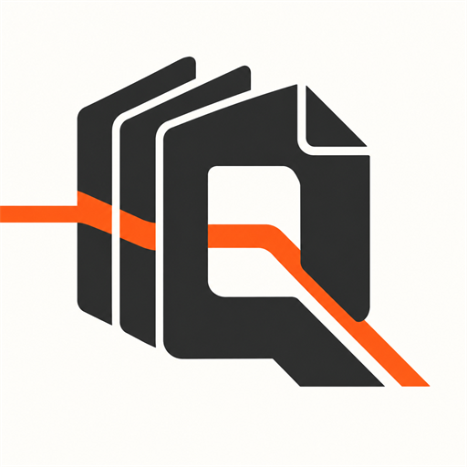

<p align="center">
  
</p>

# RAG Quality Engine

[](https://github.com/DiogoRibeiro7/rag-quality-engine/actions/workflows/ci.yml)
[](https://github.com/DiogoRibeiro7/rag-quality-engine/releases)
[](pyproject.toml)
[](LICENSE)
[](https://doi.org/10.5281/zenodo.21805398)

RAG Quality Engine is an open-source software project for building, testing, and observing retrieval-augmented generation systems.

This project is built to demonstrate practical AI engineering, not just prompt wiring. It focuses on ingestion, retrieval quality, grounded generation, measurable evaluation, and traceability through a reusable Python package, CLI, API, tests, and sample assets.

## Repository status

- Python package under `src/` with typed domain models and service boundaries.
- CLI and FastAPI entrypoints.
- Deterministic offline defaults; no model API keys are required for the main demo path.
- CI runs linting, type checking, and tests on Python 3.11, 3.12, 3.13, and 3.14.
- Licensed under MIT.
- All versions DOI: [`10.5281/zenodo.21805398`](https://doi.org/10.5281/zenodo.21805398).
- Release history is tracked in [`CHANGELOG.md`](CHANGELOG.md).

## What it does

- Ingests `.txt`, `.md`, `.csv`, and optionally `.pdf` documents with boundary-aware character, sentence-aware, or token-aware chunking.
- Supports lexical, vector, and hybrid retrieval through package APIs.
- Supports retrieve-then-rerank pipelines with a deterministic offline reranker.
- Generates evidence-grounded answers with citation validation.
- Evaluates context precision, context recall, claim-level faithfulness, citation support, unsupported claims, and refusal correctness.
- Provides opt-in embedding-backed semantic judges for answer relevance and claim support while keeping deterministic lexical judges as the offline default.
- Stores RAG traces with latency and token estimates.
- Exposes the workflow through both a CLI and a FastAPI service.
- Includes prompt regression coverage and an analytical notebook suite (see below).

## Quickstart

### 1. Install

Requires Python 3.11, 3.12, 3.13, or 3.14 and Poetry.

```bash
poetry install --with dev
```

### 2. Ingest sample documents

```bash
poetry run python -m ragops_lab.cli ingest data/sample_documents --out data/processed/chunks.jsonl
```

For sentence-aware chunking:

```bash
poetry run rag-quality-engine ingest data/sample_documents \
  --out data/processed/chunks.jsonl \
  --strategy sentence \
  --chunk-size 500 \
  --overlap 50
```

The `sentence` strategy groups complete sentences whenever they fit within the configured size and falls back safely for unusually long single sentences while preserving exact source offsets.

For token-aware chunking, `chunk_size` and `overlap` are interpreted as lexical-token counts:

```bash
poetry run rag-quality-engine ingest data/sample_documents \
  --out data/processed/chunks.jsonl \
  --strategy tokens \
  --chunk-size 200 \
  --overlap 20
```

The `tokens` strategy derives token spans from the original source text, so punctuation and whitespace between boundary tokens are preserved and chunk offsets still reproduce the exact source substring.

### 3. Ask a question

```bash
poetry run python -m ragops_lab.cli ask "Which Apollo mission first landed on the Moon?" --chunks data/processed/chunks.jsonl
```

You can also use the installed console script:

```bash
poetry run rag-quality-engine ask "Which Apollo mission first landed on the Moon?" --chunks data/processed/chunks.jsonl
```

For vector or hybrid retrieval, build the local deterministic vector index once
and reload it at query time:

```bash
poetry run rag-quality-engine index --chunks data/processed/chunks.jsonl --out artifacts/index/vector_index.json
poetry run rag-quality-engine ask "What does citation support measure?" --profile vector --index-path artifacts/index/vector_index.json
```

### 4. Run the API

```bash
poetry run uvicorn ragops_lab.api.app:app --host 0.0.0.0 --port 8000
```

Then use:

- `POST /ingest`
- `POST /index`
- `POST /search`
- `POST /ask`
- `POST /evaluate`
- `GET /traces`
- `GET /traces/{id}`
- `GET /dashboard`
- `GET /health`

See [`docs/api.md`](docs/api.md) for request bodies, response examples,
runtime settings, and error formats.

### 5. Run with Docker

```bash
docker compose up --build
```

The API is served at `http://localhost:8000`. See
[`docs/deployment.md`](docs/deployment.md) for direct Docker runs, persistent
storage, health checks, runtime configuration, and public-demo deployment
guidance.

## Notebooks

The [`notebooks/`](notebooks/) suite is an analytical walkthrough of the system,
built entirely on the package code (no notebook-only logic) and committed with
executed outputs and figures so it renders on GitHub without being re-run.

| Notebook | Focus |
| --- | --- |
| [`01_retrieval_baseline`](notebooks/01_retrieval_baseline.ipynb) | BM25 baseline, per-query score anatomy, and a `k1`×`b` parameter sweep |
| [`02_retrieval_strategies`](notebooks/02_retrieval_strategies.ipynb) | Lexical vs vector vs hybrid: recall/MRR curves, a fusion-weight sweep, and per-question win/loss analysis |
| [`03_grounded_generation`](notebooks/03_grounded_generation.ipynb) | Grounded prompting, citation validation, refusal guard-rails, and latency profiling |
| [`04_rag_evaluation`](notebooks/04_rag_evaluation.ipynb) | End-to-end scoring, operational budgets, trace persistence, and a CI-style regression gate |

They run against the bundled corpus and golden set with deterministic offline
clients, so `poetry install --with dev` is the only prerequisite. To re-execute:

```bash
poetry run jupyter nbconvert --to notebook --execute --inplace notebooks/*.ipynb
```

## Example API Calls

### Ingest

```bash
curl -X POST http://localhost:8000/ingest ^
  -H "Content-Type: application/json" ^
  -d "{\"input_dir\":\"data/sample_documents\",\"out_path\":\"data/processed/chunks.jsonl\"}"
```

### Ask

```bash
curl -X POST http://localhost:8000/ask ^
  -H "Content-Type: application/json" ^
  -d "{\"query\":\"Which Apollo mission landed on the Moon?\",\"chunks_path\":\"data/processed/chunks.jsonl\",\"top_k\":3,\"mode\":\"hybrid\"}"
```

## Architecture

The system is organized as reusable package modules instead of notebook-only logic:

```text
Raw documents
  -> ingestion
  -> chunk store
  -> retrieval
  -> generation
  -> evaluation
  -> trace store
  -> CLI / API / dashboard
```

The design principle is evaluation-first development: every generated answer should be linked to retrieved evidence, validated for citations, and measurable through explicit metrics. Retrieval can optionally widen the first-stage candidate set and apply a deterministic second-stage reranker before generation. See [`docs/architecture.md`](docs/architecture.md) for more detail.

Trace inspection is available through `GET /traces`, `GET /traces/{id}`, and
`GET /dashboard`. The list and dashboard views support `q`, `min_faithfulness`,
and `limit` filters for local debugging and demo review.

Retrieval behavior is configured through named profiles rather than hard-coded
runtime branches. The built-in profiles are `lexical`, `vector`, and `hybrid`;
requests can override `top_k`, `mode`, `lexical_weight`, `vector_weight`,
`fusion_strategy`, `rrf_k`, `rerank`, `reranker_strategy`, and
`rerank_candidate_multiplier` when needed. Hybrid retrieval supports the
backwards-compatible weighted score fusion and Reciprocal Rank Fusion (`rrf`),
which combines rank positions without requiring lexical and vector scores to be
on comparable scales. Reranking can be enabled for any retrieval mode. The default `lexical`
reranker is deterministic and offline; `reranker_strategy=embedding` uses the
configured embedding provider for semantic second-stage scoring before the final
top-k.

## Project structure

```text
src/ragops_lab/domain       Core typed models
src/ragops_lab/ingestion    Document loading, chunking, JSONL persistence
src/ragops_lab/retrieval    Tokenizer, BM25, vector, hybrid, retrieval metrics
src/ragops_lab/generation   LLM abstraction and grounded answer generation
src/ragops_lab/evaluation   RAG evaluation metrics and report export
src/ragops_lab/tracing      Trace persistence
src/ragops_lab/api          FastAPI service and dashboard
src/ragops_lab/cli.py       Command line interface
tests/                      Unit and integration coverage
data/sample_documents/      Local demo corpus
data/golden/                Prompt and retrieval regression fixtures
notebooks/                  Notebook demos built on package code
```

## Quality checks

```bash
make check
```

Or run individual gates:

```bash
make lint
make typecheck
make test
make rag-eval
make benchmark
make notebook-check
```

Golden QA fixtures can be rebuilt against the current corpus and chunking configuration when they include stable `evidence_phrases`:

```bash
poetry run rag-quality-engine golden-rebuild \
  --source-dir data/sample_documents \
  --input-path data/golden/qa-anchored.json \
  --out data/golden/qa.json \
  --chunk-size 400 \
  --overlap 60
```

Each answerable input example should contain a query and one or more exact evidence phrases. The command resolves those anchors to the current chunk IDs and keeps the phrases in the output for future rebuilds. Unanswerable examples are preserved with an empty relevant-chunk list.

`make rag-eval` runs the deterministic RAG evaluation regression gate against
the bundled golden and refusal sets and writes JSON, CSV, and Markdown reports
to `artifacts/evaluation`.

`make benchmark` runs the same dataset benchmark through the CLI. Benchmark JSON and Markdown artifacts include a SHA-256 provenance fingerprint derived from the corpus, golden/refusal fixtures, and chunking configuration, so results are comparable only when their fingerprints match. Optional `--max-p95-latency-ms` and `--max-p95-token-estimate` flags add performance/cost gates to the quality regression checks. For repeated runs or custom datasets:

```bash
poetry run rag-quality-engine benchmark --runs 3 --source-dir data/sample_documents --golden-path data/golden/qa.json --refusal-path data/golden/refusal.json --out artifacts/evaluation
```

Compare two persisted benchmark summaries:

```bash
poetry run rag-quality-engine benchmark-compare \
  artifacts/baseline/benchmark-summary.json \
  artifacts/candidate/benchmark-summary.json
```

To identify the exact queries responsible for a regression, include the
corresponding case artifacts:

```bash
poetry run rag-quality-engine benchmark-compare \
  artifacts/baseline/benchmark-summary.json \
  artifacts/candidate/benchmark-summary.json \
  --baseline-cases artifacts/baseline/cases.json \
  --candidate-cases artifacts/candidate/cases.json
```

Per-query comparison aligns cases by query and reports changes in Recall@k,
reciprocal rank, faithfulness, citation support, latency, and token usage. Added
and missing queries are surfaced explicitly.

Comparison requires matching benchmark fingerprints by default so corpus/chunking
changes are not misclassified as model regressions. Use
`--allow-mismatched-fingerprints` only when that comparison is intentional.
The command exits non-zero when monitored quality metrics decrease, p95 latency
or token usage increases, or a previously passing benchmark starts failing.

`make notebook-check` executes the committed notebooks with `nbval` so notebook
examples stay aligned with the package code.

## Runtime Configuration

The API and CLI use deterministic local defaults, but runtime paths, API safety
limits, LLM providers, and embedding providers can be overridden with
environment variables:

| Variable | Default |
| --- | --- |
| `RAGOPS_DATA_DIR` | `data` |
| `RAGOPS_ARTIFACT_DIR` | `artifacts` |
| `RAGOPS_MODEL_DIR` | `models` |
| `RAGOPS_CHUNK_PATH` | `data/processed/chunks.jsonl` |
| `RAGOPS_VECTOR_INDEX_PATH` | `artifacts/index/vector_index.json` |
| `RAGOPS_TRACE_PATH` | `artifacts/traces/traces.jsonl` |
| `RAGOPS_API_MAX_REQUEST_BYTES` | `1000000` |
| `RAGOPS_API_MAX_TOP_K` | `20` |
| `RAGOPS_API_MAX_QUERY_CHARS` | `1000` |
| `RAGOPS_API_MAX_TEXT_CHARS` | `20000` |
| `RAGOPS_LLM_PROVIDER` | `heuristic` |
| `RAGOPS_LLM_MODEL` | `heuristic-grounded` |
| `RAGOPS_LLM_ENDPOINT` | unset |
| `RAGOPS_LLM_API_KEY_ENV` | `OPENAI_API_KEY` |
| `RAGOPS_LLM_TIMEOUT_SECONDS` | `30` |
| `RAGOPS_EMBEDDING_PROVIDER` | `fake` |
| `RAGOPS_EMBEDDING_MODEL` | `fake-bow` |

`RAGOPS_LLM_PROVIDER=openai-compatible` sends grounded prompts to a configured
chat-completions endpoint and reads the API key from `RAGOPS_LLM_API_KEY_ENV`.
`RAGOPS_EMBEDDING_PROVIDER=sentence-transformers` builds and reloads vector
indexes with the configured local sentence-transformer model; the default
`fake` provider keeps tests, notebooks, and demos offline and deterministic.

API runtime failures use a stable JSON error envelope:

```json
{"error": {"code": "resource_not_found", "message": "Input directory not found: data/raw"}}
```

Pre-commit hooks are available:

```bash
poetry run pre-commit install
poetry run pre-commit run --all-files
```

See [`CONTRIBUTING.md`](CONTRIBUTING.md) for contribution guidelines and [`SECURITY.md`](SECURITY.md) for vulnerability reporting.

## Notes

- The default CLI and API generation path uses a deterministic local heuristic client so the repo works without external model credentials.
- The vector retrieval layer includes a fake embedding client for tests and an optional `sentence-transformers` adapter that can be enabled through runtime settings.
- PDF ingestion is intentionally optional and exposed through an interface boundary rather than a hard dependency.

## Portfolio signal

This repo shows operational depth around RAG systems: retrieval baselines, grounded generation, claim-level evaluation, regression testing, evaluation exports, and traceable service behavior rather than a thin demo wrapper around an LLM call.
